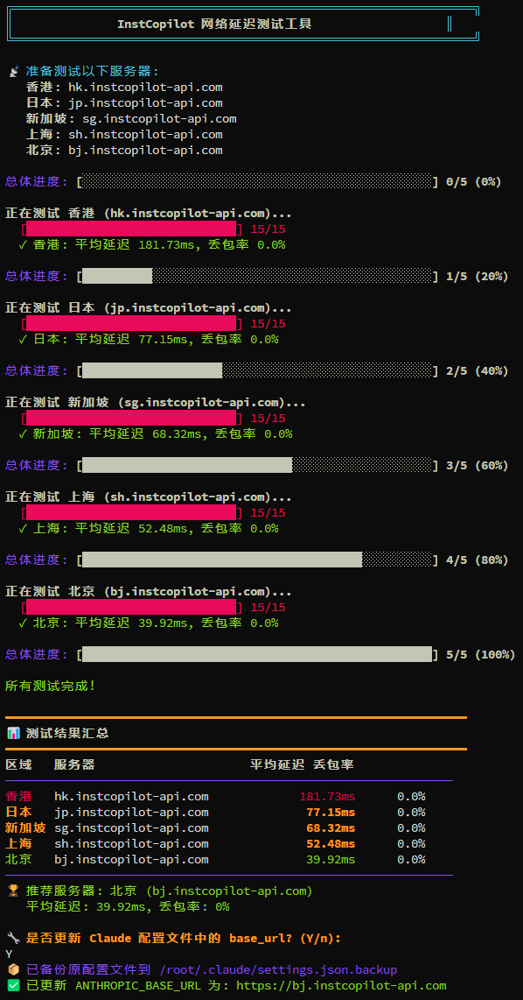

# InstCopilot Ping Tools

[English](README_EN.md)

## 📖 项目简介

InstCopilot Ping Tools 是一个网络延迟测试工具，专为优化 Claude AI 服务连接而设计。该工具可以自动测试多个服务器节点的网络延迟和稳定性，并推荐最优服务器配置。

## ✨ 主要功能

- 🌐 **多节点测试**: 同时测试香港、日本、新加坡、大陆等多个服务器节点
- 📊 **详细统计**: 显示平均延迟、丢包率等关键网络指标
- 🎯 **智能推荐**: 基于延迟和丢包率综合评分，自动推荐最优服务器
- ⚙️ **自动配置**: 可自动更新 Claude 配置文件中的 base_url
- 🎨 **友好界面**: 彩色进度条和清晰的结果展示
- 🔄 **实时监控**: 实时显示测试进度和结果
- ⚡ **智能超时**: 3秒超时，连续3次失败自动跳过

## 🖼️ 预览图



## 🚀 快速开始

### 方法一：一键运行脚本

```bash
bash <(curl -sSL https://raw.githubusercontent.com/zhiqing0205/InstCopilot-Ping-Tools/main/test.sh)
```

### 方法二：手动安装

1. **克隆仓库**
   ```bash
   git clone https://github.com/zhiqing0205/InstCopilot-Ping-Tools.git
   cd InstCopilot-Ping-Tools
   ```

2. **运行测试**
   ```bash
   chmod +x test.sh
   ./test.sh
   ```

## 📋 系统要求

- Linux 或 macOS 系统
- bash shell
- bc 计算器（如未安装会自动安装）
- ping 命令

## 🛠️ 依赖安装

工具会自动检测并安装 bc 计算器，支持的系统：

- **Ubuntu/Debian**: `apt-get`
- **CentOS/RHEL**: `yum`
- **Fedora**: `dnf`
- **macOS**: `brew`
- **Arch Linux**: `pacman`

## 📝 使用说明

1. 运行脚本后，工具将自动测试所有配置的服务器节点
2. 每个节点进行最多 15 次 ping 测试，计算平均延迟和丢包率
3. 智能超时机制：单次ping超时3秒，连续3次失败自动跳过剩余测试
4. 测试完成后显示结果汇总表格
5. 工具会推荐延迟最低、最稳定的服务器
6. 可选择是否自动更新 Claude 配置文件

## 🔧 配置说明

脚本会自动更新 `~/.claude/settings.json` 文件中的 `ANTHROPIC_BASE_URL` 配置项，在更新前会自动创建备份文件。

## 📊 测试指标

- **平均延迟**: ping 测试的平均响应时间
- **丢包率**: 测试过程中失败请求的百分比
- **综合得分**: 延迟 + (丢包率 × 10) 的综合评分

## 🌐 测试节点

- **香港**: hk.instcopilot-api.com
- **日本**: jp.instcopilot-api.com
- **新加坡**: sg.instcopilot-api.com
- **大陆**: cn.instcopilot-api.com

## 🤝 贡献

欢迎提交 Issue 和 Pull Request！

## 📄 许可证

MIT License